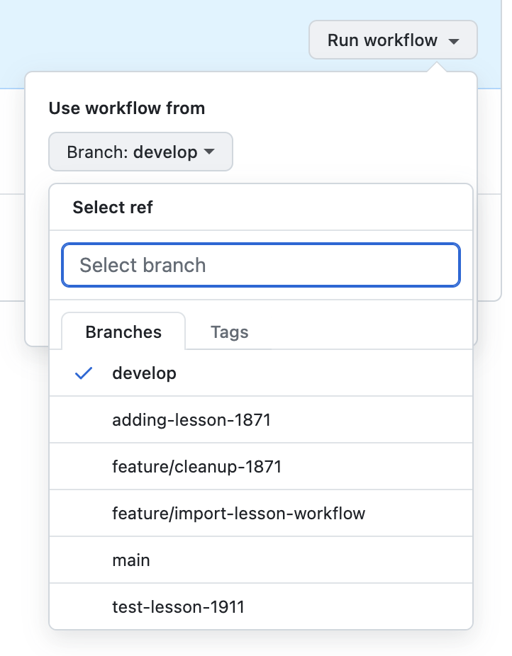
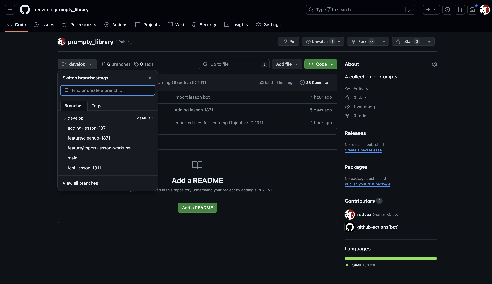
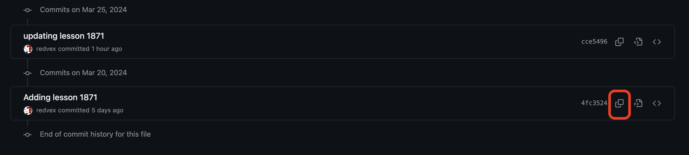
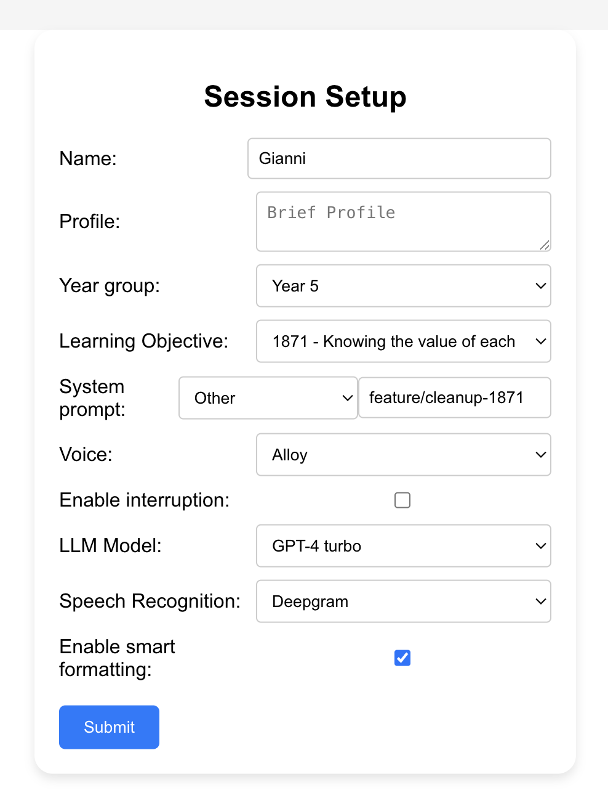

# Using the repository

## Importing an existing lesson

The prompt library is meant to be used to create a version of an existing lesson.
The first step is to create a new branch (or version) from [here](https://github.com/redvex/prompty_library/branches) by clicking "New Branch".
Make sure to not include any space in the branch name. For example a valid branch name could be: "learning-objective-2001". Another possible strategy is using the version name with its own name, for example I may create a version named "gianni".

Once the branch is created, head to the [action page](https://github.com/redvex/prompty_library/actions/workflows/import.yaml), and click "Run Workflow"
.

Select the branch where the learning object has to be imported and type the learning objective id to import.

The process takes arount 15/20 seconds to import a learning objective.

## Modify a version

To modify a version, select code and then branch
.
Then navigate to the [./education/learning-objectives](./education/learning-objectives/) folder to start editing the prompt by selecting the file and click Edit.

To make the editor's life easier, each slide is tagged with its position.

It's important to notice that every single version is logged, it means, we can point Skye to use any version even if it's not immediately visible on github.

## Select a version

To identify a version, the easiest thing to do is to use the branch name previously created. However, it's possible to point to any version by selecting the file and click "History". The version name can be copied from Github using the copy functionality:

.

PS. The version is an hash, something similar to (4fc35240680f444b61598db65dfcb9e3edd301e6).

## Using the version on the prototype

To use a specific version on the prototype, select "Other" in the system prompt configuration and copy the version on the text field.

